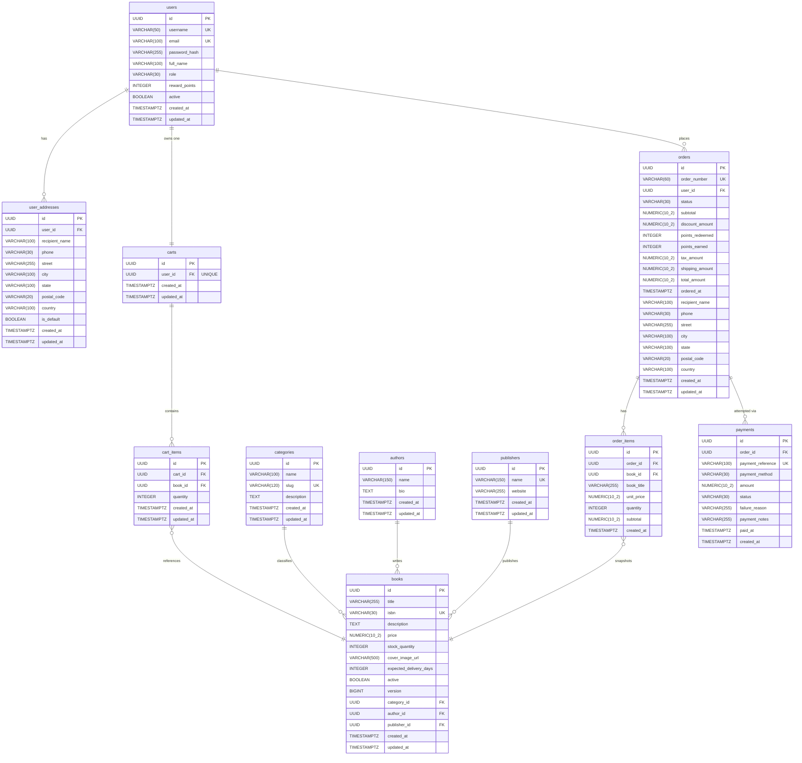

# Bookstore API — Data Model

> **Scope** This document is a design artifact derived from the Flyway migration scripts
> (`V1`–`V4`) and the OpenAPI contract in `docs/openapi.yaml`.  It describes the actual
> implemented schema, not an aspirational target.  No application code or migrations were
> modified to produce it.

---

## 1. Customer Journey → Data Entities

The capstone wireframes (slides 3 and 5–10) define twelve customer-journey steps.  The
table below maps each step to the database tables it reads from or writes to.

| Journey Step | Screen / Action | Tables Read | Tables Written |
|---|---|---|---|
| **1** | Login page | `users` | — |
| **2** | Registration / Authentication | `users` | `users`, `carts` |
| **3** | Home — recommendations & "Buy Again" | `orders`, `order_items`, `books`, `categories` | — |
| **4** | Recommendations panel (order-history) | `orders`, `order_items`, `books`, `categories` | — |
| **5** | Browse categories | `categories` | — |
| **5** | Browse brands (publishers) | `publishers` | — |
| **6** | Catalogue listing with filters | `books`, `categories`, `authors`, `publishers` | — |
| **7** | Product detail + related books + delivery estimate | `books`, `categories`, `authors`, `publishers` | — |
| **8** | Add / update / remove cart items | `books` (stock check), `carts`, `cart_items` | `cart_items` |
| **9** | Select delivery address at checkout | `user_addresses` | `user_addresses` |
| **10** | Gift-points redemption & checkout | `users` (reward_points), `cart_items`, `books` | `orders`, `order_items` |
| **11** | Simulated payment + confirmation | `orders`, `books` (stock) | `payments`, `orders` (status), `books` (stock_quantity), `users` (reward_points), `cart_items` (cleared) |
| **12** | View order / 48-hour cancellation | `orders`, `order_items`, `payments` | `orders` (status), `books` (stock restored), `users` (points reversed) |

---

## 2. Entity-Relationship Diagram

The diagram below reflects the schema exactly as defined in the Flyway migrations.



---

## 3. Key Design Decisions

### 3.1 Cart items vs. order-item snapshots

`cart_items` holds only a `book_id` reference and a `quantity`; no price is stored in the
cart.  The live price is always read from `books.price` at the time the cart is displayed
or validated.  This means the cart always reflects the current catalogue price, which is
correct for a mutable pre-purchase basket.

`order_items`, by contrast, captures `book_title`, `unit_price`, and `subtotal` at the
moment of checkout.  Once an order is created those values are immutable, so a subsequent
price change in the catalogue does not retroactively alter historical order totals or
receipts.  The `book_id` FK is still present in `order_items` so the "Buy Again" and
"Recommendations" features can navigate from past purchases back to the live catalogue
record.

### 3.2 Delivery address handling

`user_addresses` is a reusable address book: each row belongs to one user, and one row
may be flagged `is_default`.  At checkout the chosen address fields (`recipient_name`,
`phone`, `street`, `city`, `state`, `postal_code`, `country`) are **copied inline into
the `orders` row**.  This snapshot approach ensures the delivery address printed on an
order confirmation never changes even if the customer later edits or deletes the saved
address.  There is no FK from `orders` back to `user_addresses`.

### 3.3 Reward-points fields

`users.reward_points` is the running balance; it is incremented on successful payment and
decremented on order cancellation.  The `orders` table separately records both
`points_redeemed` (the discount applied at checkout, converted from points to a monetary
`discount_amount`) and `points_earned` (awarded on successful payment).

Points are earned from the order **subtotal**, not the total amount.  The exact rule
implemented in `PaymentService` is:

```
pointsToCredit = floor(order.subtotal)   // 1 point per whole dollar of subtotal
```

Using `subtotal` means tax, shipping, and any point-redemption discount do not influence
how many points are earned.  Keeping both fields on the order row allows the cancellation
reversal to be a pure arithmetic operation without an external ledger:
`new_balance = max(0, current_balance + points_redeemed − points_earned)`.

### 3.4 Inventory (stock_quantity)

`books.stock_quantity` is decremented only on **successful payment** — not at checkout.
There is no reservation step: stock is neither decremented nor locked when an order is
created or when a payment attempt fails.  Two customers can therefore both reach the payment
screen for the last copy of a book; `PaymentService` performs a fresh availability check
immediately before decrementing, and `InsufficientStockException` is thrown if stock has
run out between checkout and payment.  The optimistic-lock `version` column on `books`
prevents a double-decrement race when two concurrent successful payment requests target the
same book at the same instant.  When an order is cancelled the stock is restored by
incrementing `books.stock_quantity` by the sum of `order_items.quantity` for that order.

### 3.5 Multiple payment attempts per order (Order–Payment cardinality)

`payments.order_id` is a plain FK (no `UNIQUE` constraint), so one order can accumulate
**multiple payment rows**.  This is intentional: a `FAILED` payment (e.g., insufficient
funds, card expired, gateway timeout) is persisted as an audit record and the order
remains `PENDING_PAYMENT`, allowing the customer to retry with a different method or card.

Idempotency for already-paid orders is enforced by **service logic**, not by the unique
constraint on `payment_reference`.  When `POST /orders/{id}/payments` is called on an
order whose status is already `PAID`, `PaymentService` queries the payments table for an
existing `SUCCESS` record and returns it unchanged — no new payment row is created.  The
`payment_reference` unique constraint's role is narrower: it guarantees that each
individual payment attempt (including failed ones) receives a collision-safe reference,
preventing accidental duplicate persistence of the same attempt.

### 3.6 One cart per user

`carts.user_id` carries a `UNIQUE` constraint, enforcing a strict one-cart-per-user
invariant at the database level.  The cart row itself is created automatically on user
registration and is never deleted.

When the cart is "cleared" after a successful payment, `PaymentService` calls
`cart.getItems().clear()` and saves the cart through JPA.  Because the `Cart` entity
declares `@OneToMany(cascade = CascadeType.ALL, orphanRemoval = true)`, Hibernate detects
the now-empty collection and issues `DELETE` statements for the removed `cart_items` rows.
This is **JPA orphan-removal**, not the `ON DELETE CASCADE` constraint in the DDL.  The
SQL-level `ON DELETE CASCADE` on `cart_items.cart_id` is a safety net that applies only if
the `carts` row itself were deleted directly in the database.  The explicit `DELETE /api/v1/cart`
endpoint (called by a customer) follows the same JPA path: it clears the in-memory
collection and saves, leaving the `carts` row intact.

---

## 4. Schema Constraints Summary

| Constraint | Table | Detail |
|---|---|---|
| `UNIQUE` | `users.username`, `users.email` | Prevents duplicate accounts |
| `UNIQUE` | `categories.slug` | URL-safe category identifier |
| `UNIQUE` | `publishers.name` | No duplicate publisher records |
| `UNIQUE` | `books.isbn` | One catalogue entry per ISBN |
| `UNIQUE` | `carts.user_id` | One active cart per customer |
| `UNIQUE` | `cart_items(cart_id, book_id)` | No duplicate book in the same cart |
| `UNIQUE` | `orders.order_number` | Human-readable order reference |
| `UNIQUE` | `payments.payment_reference` | Idempotency guard per attempt |
| `CHECK`  | `cart_items.quantity > 0` | Quantity must be positive |
| `CHECK`  | `order_items.quantity > 0` | Quantity must be positive |
| `ON DELETE CASCADE` | `user_addresses → users` | Addresses removed with account |
| `ON DELETE CASCADE` | `cart_items → carts` | Safety net if `carts` row deleted directly; normal clearing uses JPA orphan-removal |
| `ON DELETE CASCADE` | `order_items → orders` | Line items removed with order |
| Optimistic lock | `books.version` | Prevents concurrent stock-decrement races |
